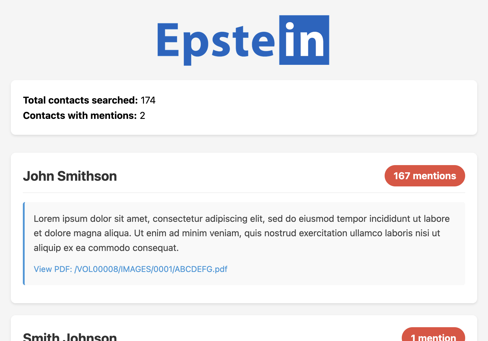

# EpsteIn

Search publicly released Epstein files for mentions of your LinkedIn connections, then generate a sortable HTML report with excerpts and source PDF links.

## What it does

- Loads contacts from a LinkedIn `Connections.csv` export
- Searches each full name as an exact quoted phrase (for example, `"Jane Doe"`)
- Calls the DugganUSA search API and collects hit counts + snippets
- Generates an HTML report sorted by mention count
- Caches results locally to reduce repeat API calls

## Requirements

- Python 3.6+
- `requests` (installed via `requirements.txt`)
- A free API key from https://epstein.dugganusa.com/register.html

## Installation

### Windows (PowerShell)

```powershell
git clone https://github.com/cfinke/EpsteIn.git
cd EpsteIn
python -m venv project_venv
.\project_venv\Scripts\Activate.ps1
pip install -r requirements.txt
```

### macOS / Linux

```bash
git clone https://github.com/cfinke/EpsteIn.git
cd EpsteIn
python3 -m venv project_venv
source project_venv/bin/activate
pip install -r requirements.txt
```

## Export your LinkedIn contacts

1. Sign in to [linkedin.com](https://www.linkedin.com).
2. Open **Settings & Privacy**.
3. Go to **Data privacy**.
4. Under "How LinkedIn uses your data", choose **Get a copy of your data**.
5. Request **Connections** (or the larger archive if needed).
6. Download and extract the archive when LinkedIn emails you.
7. Locate `Connections.csv`.

## Usage

```bash
python EpsteIn.py --connections /path/to/Connections.csv
```

Optional output path:

```bash
python EpsteIn.py --connections /path/to/Connections.csv --output report.html
```

### CLI options

| Flag | Required | Description |
|------|----------|-------------|
| `--connections`, `-c` | Yes | Path to LinkedIn `Connections.csv` |
| `--output`, `-o` | No | Output HTML file (default: `EpsteIn.html`) |

## First-run behavior

On first run, the script prompts for an API key and stores it in:

- `.epstein_api_key`

It also stores cached search results in:

- `.epstein_cache.json`

Cache behavior:

- Contacts searched in the last ~23 hours are skipped
- Freshly searched contacts are cached immediately
- Pressing `Ctrl+C` still produces a partial report from fresh + cached data

## Report contents

The generated HTML report includes:

- Total connections searched
- Number of connections with mentions
- One card per matching contact with:
  - Name, position, and company
  - Mention count
  - Snippet/excerpt text
  - Link to source PDF (justice.gov)

Results are sorted by total mentions (highest first).



## Project layout

- `EpsteIn.py` — main CLI script
- `requirements.txt` — Python dependencies
- `assets/logo.png` — report/logo image
- `assets/screenshot.png` — sample output screenshot

## Notes and limitations

- Matching is exact phrase search on full name.
- Common names can produce false positives.
- Hit snippets come from the upstream search index.
- Data source/indexing is provided by [DugganUSA.com](https://dugganusa.com).

## Troubleshooting

- **`requests` import error**: run `pip install -r requirements.txt`
- **No contacts found**: verify you selected LinkedIn **Connections** and passed the right CSV
- **Rate limiting (HTTP 429)**: script backs off and retries automatically
- **Unauthorized API call**: check your stored `.epstein_api_key` value

